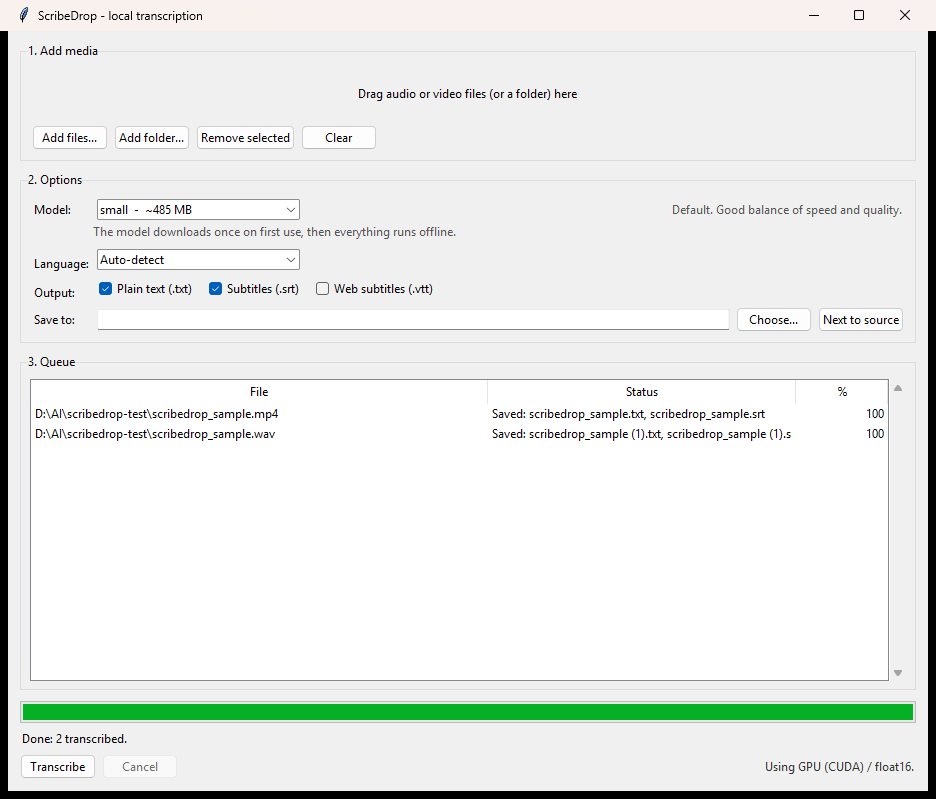

# ScribeDrop — a free Whisper GUI for Windows

**Drag an audio or video file onto a window. Get a transcript and subtitles back, computed on your own PC.
No upload, no account, no subscription, no command line.**

Free and open source. Works fully offline after a one-time model download.



---

## Why this exists

If you have looked for **MacWhisper for Windows** and come away empty-handed, this is why ScribeDrop exists.

Mac users get one window: drag a file in, get a subtitle file out. Windows users get handed a command line.
The engine everyone actually uses — [`faster-whisper`](https://github.com/SYSTRAN/faster-whisper), a
CTranslate2 port of OpenAI's Whisper — is free, open source and downloaded millions of times a month. But
running it on Windows has meant setting up a Python environment, hunting down CUDA libraries, and typing
`--model large-v3 --output_format srt` at a prompt.

So people either pay a cloud service per minute of audio, or pay for a closed-source Windows clone of a Mac
app, for something their own computer can do for nothing.

ScribeDrop is the missing front end: the same engine, wrapped in a window.

## What it does

- **Drag and drop** files or whole folders onto the window. (Or use *Add files…*, or drop files onto the launcher.)
- **A queue** with per-file progress, an overall progress bar, and a Cancel button that actually works mid-file.
- **Model picker** — tiny / base / small / medium / large-v3, with download sizes shown. Defaults to `small`,
  which is a much smaller download than `large-v3` and good enough for most speech.
- **Language** auto-detect, or pick one of 28 explicitly: English, Spanish, French, German, Italian,
  Portuguese, Dutch, Polish, Russian, Ukrainian, Turkish, Arabic, Hebrew, Hindi, Chinese, Japanese, Korean,
  Swedish, Norwegian, Danish, Finnish, Czech, Greek, Romanian, Hungarian, Indonesian, Vietnamese, Thai.
- **Outputs**: `.txt`, `.srt`, `.vtt` — any combination. Written next to the source file, or into a folder you choose.
- **GPU when you have one, CPU when you don't** — and the status line always tells you which, e.g.
  `Using GPU (CUDA) / float16` or `Using CPU / int8`. It never silently falls back to the slow path.
- Existing files are never overwritten; a second run produces `interview (1).srt`.

### Generate SRT subtitles locally

If subtitles are what you came for: tick **Subtitles (.srt)**, drop the video in, press Transcribe. You get a
standards-shaped `.srt` next to the video, with sequential indices and monotonic timestamps, ready for
YouTube, Premiere, DaVinci Resolve, VLC or anything else that eats subtitle files. `.vtt` for the web works
the same way, and both can be written from the same run.

Here is a real `.srt` ScribeDrop wrote, unedited:

```srt
1
00:00:00,000 --> 00:00:02,600
Thanks for trying scribe drop.

2
00:00:02,600 --> 00:00:11,140
Drop a video or audio file onto this window, and it writes a subtitle file next to it, using your own computer to do the work.

3
00:00:11,140 --> 00:00:15,060
No upload, no account, and no subscription required.
```

### Which model should I pick?

- **tiny** — fastest, smallest download. Good for a rough draft you'll skim, not trust.
- **base** — still quick, a step up in accuracy. Fine for casual notes.
- **small** *(default)* — the everyday pick: good accuracy for a download most people won't notice.
- **medium** — slower and a bigger download, worth it for accents, background noise, or a talk you'll publish.
- **large-v3** — the most accurate, the slowest, and the biggest download — pick it when the transcript itself is the deliverable and you have a decent GPU.

## Your audio never leaves your machine

Transcription runs entirely on your own CPU or GPU. No upload, no account, no server, no telemetry —
ScribeDrop has no analytics, no crash reporting and no update check.

**One exception, stated plainly:** the first time you use a given model size, ScribeDrop downloads the model
weights from Hugging Face. That's a normal file download and it sends no audio, no filenames and no
information about you. After that download, ScribeDrop works with your network cable unplugged, and it does
not contact the internet again.

That last sentence is load-bearing, so it is enforced in code rather than hoped for: once a model is on disk
it is opened with `local_files_only=True`, which stops `huggingface_hub` from making its routine
"has this changed?" call to huggingface.co on every launch. The verification for the release build was a
local HTTP server standing in for huggingface.co — a cached run sent it **zero requests**. The code is short
enough to check that claim yourself; start at [`scribedrop/engine.py`](scribedrop/engine.py).

## How it compares to a paid Mac app

ScribeDrop is not a MacWhisper clone and it is not trying to be. Here is the honest shape of the difference,
with no numbers attached to it, because we have not benchmarked ScribeDrop against anything and will not
publish figures we have not measured.

| | ScribeDrop | A typical paid transcription app |
|---|---|---|
| Cost | Free | Paid, one-off or subscription |
| Source | Open, MIT, all of it in this repo | Closed |
| Platform | Windows | Usually macOS; the polished ones are Mac-first |
| Where audio is processed | Your machine | Your machine, for the local ones |
| Engine | faster-whisper (OpenAI Whisper models) | Usually Whisper too |
| Recording, editing, diarisation, batch automation | **No** — see *Known limits* | Often yes; that is what you are paying for |
| Support you can shout at | An issue tracker and no promises | A company |

If you need speaker labels, an in-app transcript editor, live recording or a support contract, buy the paid
app — it will serve you better and we would rather tell you that than take your afternoon. If you want a free
transcription app for Windows that turns a file into a subtitle file without sending your audio anywhere,
that is exactly what this is.

## Is it free? Yes, and here is the boundary

ScribeDrop is free and open source. A paid Pro tier with watch-folders, speaker labels and subtitle
formatting is planned; everything in this repo today stays free.

**There is nothing to buy right now.** No price, no pre-order, no waitlist, no email capture, no "upgrade"
button that leads anywhere. If and when a Pro tier exists it will be announced here; until then, this page is
the whole product.

## Install

**If you have an NVIDIA GPU, use Option B — it transcribes substantially faster than Option A.**

### Option A — Standalone (no Python needed, CPU only)

1. Download `ScribeDrop-0.1.0-win64-cpu.zip` from [Releases](../../releases).
2. Unzip it anywhere.
3. Run `ScribeDrop.exe`.

Simplest path. Measured on this machine (AMD Ryzen 7 7800X3D, CPU-only path) transcribing a 5-minute audio
file with the default `small` model: **19.0 seconds**. Use Option B if you have an NVIDIA card. Tested on
Windows 11 x64; it is built for Windows 10/11 x64 and ships the C runtime it needs, but one machine is the
only machine we have proved it on.

### Option B — From source (uses your NVIDIA GPU)

Requires [Python 3.10+](https://www.python.org/downloads/) with the *Add python.exe to PATH* box ticked.

1. Download `ScribeDrop-0.1.0-source.zip` from [Releases](../../releases), or `git clone` this repo.
2. Double-click **`setup.bat`**. It creates a private `.venv`, installs the requirements, detects whether you
   have an NVIDIA GPU, and if so installs the CUDA libraries automatically (a large one-time download).
3. Double-click **`ScribeDrop.bat`**.

Measured on this machine (NVIDIA RTX 4070 Ti, GPU path) transcribing the same 5-minute audio file with the
same `small` model: **4.5 seconds**. Same input, same model, only the device changed.

That is the whole install. Everything ScribeDrop creates for itself lives in the project folder or in
`%LOCALAPPDATA%\ScribeDrop` (settings and downloaded models). Transcripts go next to your source file by
default, or wherever you point the output folder; during a run it also uses a temporary folder under `%TEMP%`,
which it cleans up after itself.

## System requirements

Approximate, and measured casually rather than benchmarked:

|  | Minimum | For the GPU path |
|---|---|---|
| OS | Windows 10 / 11, 64-bit | same |
| RAM | 4 GB (`small` model) | 8 GB |
| Disk | ~1 GB for the app + `small` model | ~2.5 GB (CUDA libraries) |
| GPU | none — CPU works | NVIDIA, driver 525+, 4 GB VRAM for `small`, 8 GB+ for `large-v3` |
| Python | not needed (Option A) | 3.10+ (Option B) |

**FFmpeg is optional.** ScribeDrop decodes audio through PyAV, which carries its own FFmpeg libraries, so
most files just work. A separately installed FFmpeg is used only as a fallback for unusual containers; if it
is missing the app says so and tells you to run `winget install Gyan.FFmpeg`. We deliberately do **not**
bundle `ffmpeg.exe` — see [THIRD-PARTY-NOTICES.md](THIRD-PARTY-NOTICES.md) §3 for exactly what media
libraries do end up inside the standalone download, and under which licences.

## Supported input

**Audio:** mp3, wav, m4a, aac, flac, ogg, oga, opus, wma, aiff
**Video:** mp4, mkv, mov, avi, webm, m4v, wmv, flv, mpg, mpeg, ts (the audio track is used)

## Command line (optional)

The GUI is the product, but the launcher accepts arguments, so you can drop files straight onto
`ScribeDrop.bat` or wire it into a Send To shortcut:

```
ScribeDrop.bat "C:\clips\interview.mp4"              # queue it, wait for you to press Transcribe
ScribeDrop.bat "C:\clips\interview.mp4" --autostart  # queue it and start immediately
```

## Windows will warn you the first time — here's why, and how to check

ScribeDrop's `.exe` is **not code-signed**. A code-signing certificate costs a few hundred dollars a year,
and this is a free project, so Windows SmartScreen will show *"Windows protected your PC"* the first time you
run it. Click **More info → Run anyway**.

Your antivirus may also flag it. This is a known false positive affecting almost every PyInstaller-packaged
Python app: the executable unpacks a Python interpreter at startup, which pattern-matches against malware
droppers. It is not evidence of anything, and it is also not proof of innocence — so verify instead of
trusting us:

- **Check the SHA-256** of your download against the checksum published in the release notes.
- **Scan it yourself** on [VirusTotal](https://www.virustotal.com).
- **Skip the binary entirely** — clone the repo and run from source. That's the whole point of publishing it.

## What ScribeDrop is not

ScribeDrop produces machine transcription. Like all Whisper-based tools it makes mistakes, and on silence,
background music or poor audio it can occasionally generate fluent text that was never spoken. **Always check
the transcript against the audio before relying on it.**

Do not use ScribeDrop as the sole record for medical, legal, financial, safety-critical or evidentiary
purposes. It is not a certified transcription service and it provides no medical, legal or financial advice.
Provided as-is, with no warranty of accuracy — see the [LICENSE](LICENSE).

You're responsible for having the right to transcribe what you feed it. Recording someone without consent is
illegal in many places.

## Known limits in v0.1.0

- No live/microphone recording — files only.
- No speaker diarisation ("who said what").
- No subtitle line-length or characters-per-second shaping; segments come out as Whisper produces them.
- No editor for fixing a transcript in-app.
- `.srt` files are written with LF line endings. Every player we tried accepts them; a few legacy subtitle
  editors prefer CRLF.
- The standalone bundle is CPU-only by design (see `build_exe.bat` for why).

## Development

```bat
python -m venv .venv
.venv\Scripts\pip install -r requirements-dev.txt
.venv\Scripts\python -m pytest        REM 150 tests
.venv\Scripts\python -m scribedrop    REM run the app
build_exe.bat                         REM build the standalone bundle
```

Layout: `formats.py` (subtitle rendering), `paths.py` (where output goes), `settings.py`, `catalog.py`
(models/languages), `media.py` (file checks, FFmpeg), `cuda_paths.py` (CUDA DLL discovery),
`engine.py` (faster-whisper), `writer.py`, `runner.py` (worker thread), `app.py` (Tk UI).

The test suite covers `formats.py`, `paths.py`, `settings.py`, `catalog.py`, `media.py`, `writer.py`, the
device-selection policy and model-cache policy in `engine.py`, the queue bookkeeping in `runner.py`, and
drag-and-drop registration on a real Tk root. `app.py` and the model-loading internals of `engine.py` are
exercised by hand; the GUI holds no transcription logic. Note that the drag-and-drop test skips itself on a
machine with no display, so a headless run reports 147 rather than 150.

## Built with AI assistance

ScribeDrop was written with substantial help from AI coding tools. Every line has been reviewed and tested by
a human before release, but you should treat it the way you'd treat any small open-source project from an
unfamiliar author: the source is right here, and you're welcome to read it before you run it.

## Credits and licences

ScribeDrop itself is MIT licensed. It stands on other people's work:

- **Whisper** speech recognition models — © 2022 OpenAI, released under the MIT License. Model weights are
  downloaded from Hugging Face on first run and are not redistributed with this app.
- **faster-whisper** — © 2023 SYSTRAN, MIT License. The CTranslate2 model conversions we download are
  published by SYSTRAN under the MIT License.
- **CTranslate2** — © 2018– SYSTRAN, © 2019– The OpenNMT Authors, MIT License.
- **Silero VAD** — MIT License.
- **tkinterdnd2** — © 2020 Philippe Gagné, MIT License; bundles **tkdnd** by Georgios Petasis and Kevin
  Walzer / WordTech Communications LLC under a BSD-style licence.
- **PyAV** — BSD-3-Clause. It is how ScribeDrop reads your media files.
- **The FFmpeg command-line program is *not* bundled.** ScribeDrop detects an FFmpeg installation on your
  system and tells you how to install one if it's missing. The standalone `.zip` does, however, contain the
  FFmpeg *libraries* that arrive inside the PyAV wheel — including two GPL-licensed ones we cannot remove
  without breaking audio decoding. That is spelled out in full in
  [THIRD-PARTY-NOTICES.md](THIRD-PARTY-NOTICES.md) §3, because you deserve to know what is in the box.

Full notices: [THIRD-PARTY-NOTICES.md](THIRD-PARTY-NOTICES.md)

The interface is drawn with plain Tk from the Python standard library — there is no CustomTkinter or other
UI framework in the dependency tree.
